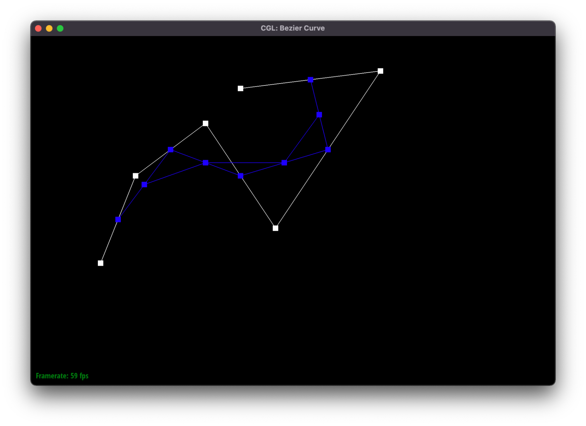

# CS184 Project 1 Write-Up – Rory Na, Stephen Yang

## TASK 1

De Casteljau's algorithm is a recursive method to evaluate the Bezier curves by weighting two consecutive control points by t and 1 - t respectively. This way, after many rounds of the “corner cutting” subdivision, we can generate a curve.

In my implementation, I looped through the given points in svaluateStep, and for each pair of points, I calculated a new point by weighting the pair by t and 1 - t. These newly evaluated points are stored and returned.

Below are the evaluation steps of a Bezier Curve:

Below is a slightly different Bezier Curve:

## TASK 2

De Casteljau algorithm extends to surfaces by applying recursively on two dimensions to form a 2D surface, and we can use 2 the linear interpolation parameters in an arbitrary sequence.

In terms of our own implementation, the algorithm is first evaluated as before to recursively form the intermediate 1D control points on the first scalar interpolation parameter u, and afterward, we evaluated the surface from these 1D control points by running another layer of De Casteljau on the other scalar interpolation parameter v.

Below is bez/teapot.bez rendered using our implementation:

## TASK 3

We implemented area-weighted vertex normals by finding the normals of the faces around the vertex and then computing a weighted sum of the normals with the weights being the area of each face. The area of a triangle with vertices A, B and C was calculated using the formula 0.5 * | AB x AC |. The weighted sum was then normalized and used as the normal vector for the vertex.

Before Shading:

After Shading:

## TASK 4

We implemented the edge flip operation with the following diagram for reference.

For each of the elements (halfedges, edges, vertices, faces) in the before picture, we reassigned its pointers to be the same as the after picture. We reassigned next, twin, edge, vertex and face pointers for halfedges and only halfedges pointers for edges, vertices and faces.

Before Flip:

After Flip:

## TASK 5

We implemented the edge split operation with the following diagram for reference.

Similarly to part 4, for each of the elements (halfedges, edges, vertices, faces) in the before picture, we reassigned its pointers to be the same as the after picture. We reassigned next, twin, edge, vertex and face pointers for halfedges and only halfedges pointers for edges, vertices and faces. The newly created edges (e6 and e7) and the newly created vertex (v4) were marked as new in preparation for the next part.

## TASK 6

To implement the loop subdivision, we first set all existing vertices and edges to be old. This step is necessary for repeated subdivisions. Then, we calculate and store updated positions for all the old vertices using the formula given in lecture. After that, we calculate and store updated positions for all the new vertices using the formula given in lecture. Then, we split all the old edges in the mesh. After that, we flip all the new edges that connect an old vertex with a new vertex in the mesh. Finally, we update the positions of all the old and new vertices using their stored positions.

After applying subdivision, sharp corners and edges become smoother. We can reduce this effect by splitting edges near the sharp corners/edges.

Below is doing the procedure on the cube:

The above images show subdividing the cube without performing any preprocessing. The cube becomes asymmetric after repeated subdivisions.

The below images show subdividing the cube with preprocessing, which is splitting the diagonals of the cube before subdivision. The cube remains symmetric after repeated subdivisions. Splitting the diagonals makes the low-resolution mesh symmetric, which makes the high-resolution mesh symmetric as well.

## TASK 7

Beyond the simple humanoid mesh described in the tutorial, we made a mesh with hands, feet, elbows and knees, and also made a open arm posture.

